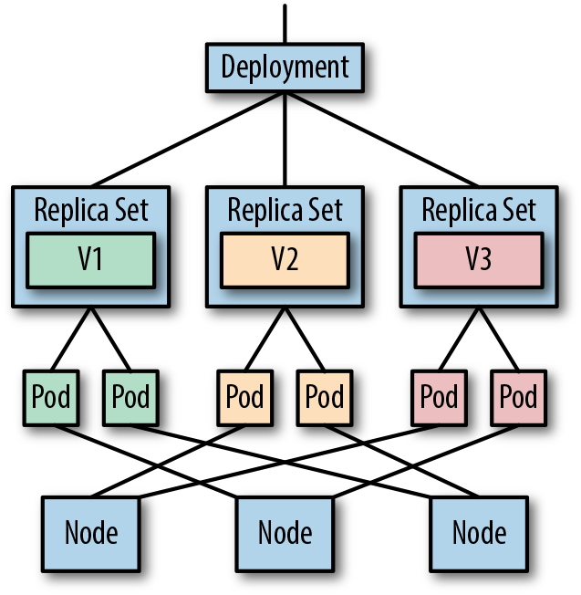
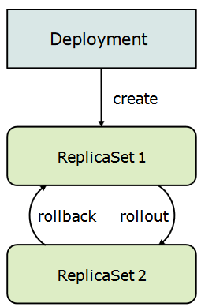

# Pod, ReplicaSet, Deployment

Bu kavramlar tamamen mantıksal kavramlardır. 

Önce çalışmak için bir ad alanı oluşturun:

```bash
kubectl create namespace myspace
kubectl config set-context --current --namespace=myspace

```





## Pod 

Pod, birden fazla konteyneri içeren ve bu konteynerlerin aynı fiziksel veya sanal makinede çalışmasını sağlayan bir kavramdır. Bu konteynerler, birbirleriyle iletişim kurabilirler ve aynı kaynakları paylaşabilirler. Pod, birim olarak yönetilir ve Kubernetes, podların sağlığını kontrol ederek, yeniden başlatarak ve gerektiğinde yeniden oluşturarak uygulamanın sürekli çalışmasını sağlar.

Pod'lar, Kubernetes'in temel yapı taşlarından biridir ve uygulamaların oluşturulmasını ve yönetilmesini kolaylaştırır. Pod'lar, uygulamanın farklı parçalarını bir arada tutarak, uygulamanın bütünlüğünü ve güvenliğini korur.

* yalnız pod (prodda kullanmayın)
  
```bash
cat <<EOF | kubectl apply -f -
apiVersion: v1
kind: Pod
metadata:
  name: quarkus-demo
spec:
  containers:
  - name: quarkus-demo
    image: quay.io/rhdevelopers/quarkus-demo:v1
EOF

```

* Durumuna bak

```bash
watch kubectl get pods

NAME           READY   STATUS              RESTARTS   AGE
quarkus-demo   0/1     ContainerCreating   0          10s

## bir süre sonra

NAME           READY   STATUS    RESTARTS   AGE
quarkus-demo   1/1     Running   0          18s

```

Poda erişelim

```bash
kubectl exec -it quarkus-demo /bin/sh

## pod içinden web servis çalışıyor mu bakıyoruz?

curl localhost:8080

Supersonic Subatomic Java with Quarkus quarkus-demo:1

```

Önceki Pod'u silelim:

```bash
kubectl delete pod quarkus-demo

watch kubectl get pods

NAME           READY   STATUS        RESTARTS   AGE
quarkus-demo   0/1     Terminating   0          9m35s

No resources found in myspace namespace.

```

## ReplicaSet

Replicaset, pod'ların istenen sayıda kopyasını oluşturma, yönetme ve kontrol etme işlemini otomatikleştirir. Yani, Replicaset, belirli bir pod sayısını korumak için pod'ların ölçeklenmesini otomatik olarak yapar. Örneğin, bir uygulamanın üç kopyasının her zaman çalışır durumda olmasını sağlamak için, bir Replicaset yapılandırılabilir ve bu şekilde uygulama ölçeklenebilir hale getirilir.

Replicaset, uygulamanın sağlığını kontrol eder ve pod'ların yanıt vermediğinde veya yanıt vermediğinde yeniden oluşturulmasını sağlar. Ayrıca, Replicaset, yeni pod'ların oluşturulmasını da sağlayabilir, böylece uygulama yükü arttığında ölçeklenebilirlik sağlanır.

Replicaset, Kubernetes'in güvenilirlik ve ölçeklenebilirlik özelliklerine katkıda bulunan önemli bir yapıdır.

```bash
cat <<EOF | kubectl apply -f -
apiVersion: apps/v1
kind: ReplicaSet
metadata:
    name: rs-quarkus-demo
spec:
    replicas: 3
    selector:
       matchLabels:
          app: quarkus-demo
    template:
       metadata:
          labels:
             app: quarkus-demo
             env: dev
       spec:
          containers:
          - name: quarkus-demo
            image: quay.io/rhdevelopers/quarkus-demo:v1
EOF

```
Etiketleriyle podları getirin

```sh
watch kubectl get pods --show-labels

NAME                    READY   STATUS    RESTARTS   AGE   LABELS
rs-quarkus-demo-jd6jk   1/1     Running   0          58s   app=quarkus-demo,env=dev
rs-quarkus-demo-mlnng   1/1     Running   0          58s   app=quarkus-demo,env=dev
rs-quarkus-demo-t26gt   1/1     Running   0          58s   app=quarkus-demo,env=dev

# replicasetleri getirin.

kubectl get rs

NAME              DESIRED   CURRENT   READY   AGE
rs-quarkus-demo   3         3         3       79s
```

ReplicaSet'i tanımlayın

```sh

kubectl describe rs rs-quarkus-demo

Name:         rs-quarkus-demo
Namespace:    myspace
Selector:     app=quarkus-demo
Labels:       <none>
Annotations:  kubectl.kubernetes.io/last-applied-configuration:
                {"apiVersion":"apps/v1","kind":"ReplicaSet","metadata":{"annotations":{},"name":"rs-quarkus-demo","namespace":"myspace"},"spec":{"replicas...
Replicas:     3 current / 3 desired
Pods Status:  3 Running / 0 Waiting / 0 Succeeded / 0 Failed
Pod Template:
  Labels:  app=quarkus-demo
           env=dev
  Containers:
   quarkus-demo:
    Image:        quay.io/rhdevelopers/quarkus-demo:v1
    Port:         <none>
    Host Port:    <none>
    Environment:  <none>
    Mounts:       <none>
  Volumes:        <none>
Events:
  Type    Reason            Age   From                   Message
  ----    ------            ----  ----                   -------
  Normal  SuccessfulCreate  89s   replicaset-controller  Created pod: rs-quarkus-demo-jd6jk
  Normal  SuccessfulCreate  89s   replicaset-controller  Created pod: rs-quarkus-demo-t26gt
  Normal  SuccessfulCreate  89s   replicaset-controller  Created pod: rs-quarkus-demo-mlnng

```
Bu rs tarafından kontrol edilen nodlar

```sh

kubectl get pod rs-quarkus-demo-mlnng -o json | jq ".metadata.ownerReferences[]"

{
  "apiVersion": "apps/v1",
  "blockOwnerDeletion": true,
  "controller": true,
  "kind": "ReplicaSet",
  "name": "rs-quarkus-demo",
  "uid": "1ed3bb94-dfa5-40ef-8f32-fbc9cf265324"
}

```
Başka bir ekranda izlerken diğer ekranda podu silin

```sh

# 1. terminal

watch kubectl get pods --show-labels

# 2. terminal
kubectl delete pod rs-quarkus-demo-mlnng

```

1. terminalde silinen podun yeniden üretildiğini farkedeceksiniz.

## Deployment

Kubernetes'de, uygulamanın güncellenmesi ve sürüm kontrolü gibi işlemleri yönetmek için "Deployment" adında bir yapı kullanılır. Deployment, pod'ların belirli bir özellik setini tanımlayan bir YAML dosyası aracılığıyla yapılandırılır.

Deployment, uygulamanın önceki sürümlerinden farklı olarak, belirli bir zamanda kaç pod'un çalışması gerektiğini belirleyen Replicaset yapılarını oluşturur. Ayrıca, Deployment, güncelleme işlemini gerçekleştirirken eski sürüm pod'larının kaldırılması ve yeni sürüm pod'larının oluşturulması gibi işlemleri otomatik olarak yapar.

Deployment, önceden tanımlanmış bir stratejiye göre işlem yaparak, uygulamanın durmamasını veya müşterilerin etkilenmemesini sağlayarak güncelleme işlemini gerçekleştirir. Yani, Deployment yapılandırılırken, uygulama güncellemeleri gerçekleştirilirken nelere dikkat edilmesi gerektiği ve hangi stratejilerin kullanılacağı belirlenir.

Deployment, uygulamanın farklı sürümlerinin yönetimini kolaylaştırır ve uygulama sürümleri arasında hızlı bir şekilde geçiş yapılmasına olanak tanır. Bu sayede, uygulama geliştirme süreci daha hızlı ve güvenli hale getirilebilir.

```sh

cat <<EOF | kubectl apply -f -
apiVersion: apps/v1
kind: Deployment
metadata:
  name: quarkus-demo-deployment
spec:
  replicas: 3
  selector:
    matchLabels:
      app: quarkus-demo
  template:
    metadata:
      labels:
        app: quarkus-demo
        env: dev
    spec:
      containers:
      - name: quarkus-demo
        image: quay.io/rhdevelopers/quarkus-demo:v1
        imagePullPolicy: Always
        ports:
        - containerPort: 8080
EOF

```

```sh
kubectl get pods --show-labels

NAME                                       READY   STATUS    RESTARTS   AGE   LABELS
quarkus-demo-deployment-5979886fb7-c888m   1/1     Running   0          17s   app=quarkus-demo,env=dev,pod-template-hash=5979886fb7
quarkus-demo-deployment-5979886fb7-gdtnz   1/1     Running   0          17s   app=quarkus-demo,env=dev,pod-template-hash=5979886fb7
quarkus-demo-deployment-5979886fb7-grf59   1/1     Running   0          17s   app=quarkus-demo,env=dev,pod-template-hash=5979886f

```

```sh
kubectl exec -it quarkus-demo-deployment-5979886fb7-c888m -- curl localhost:8080

```

## Dönüşüm

### pod 
```yaml

apiVersion: v1
kind: Pod
metadata:
  name: nginx-pod
  labels:
    app: nginx
###     
spec:
  containers:
  - name: nginx
    image: nginx:1.14.2
    ports:
    - containerPort: 80
###
```

### replicaset

```yaml

apiVersion: apps/v1   ## 
kind: ReplicaSet  ## 
metadata:
  name: nginx-replicaset
  labels:
    app: nginx
## replicaset    
spec:
  replicas: 3
  selector:
    matchLabels:
      app: nginx
  template:
    metadata:
      labels:
        app: nginx
## replicaset        
    spec:
      containers:
      - name: nginx
        image: nginx:1.14.2
        ports:
        - containerPort: 80
```

## deployment

```yaml
apiVersion: apps/v1
kind: Deployment
metadata:
  name: nginx-deployment
  labels:
    app: nginx
spec:
  replicas: 3
  selector:
    matchLabels:
      app: nginx
  template:
    metadata:
      labels:
        app: nginx
    spec:
      containers:
      - name: nginx
        image: nginx:1.14.2
        ports:
        - containerPort: 80
```


[Sonraki](service.md)
