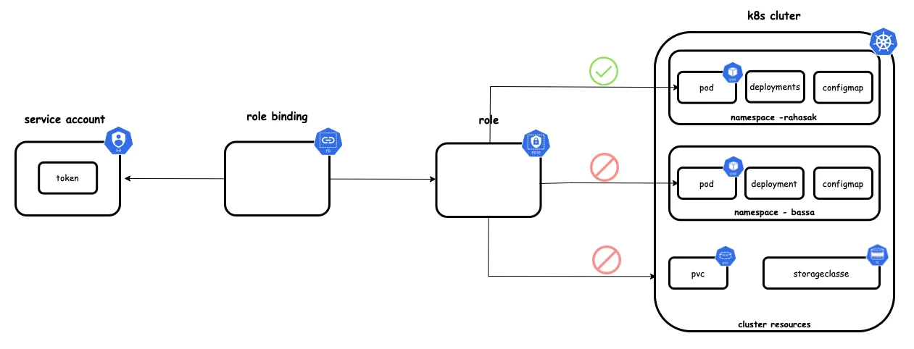
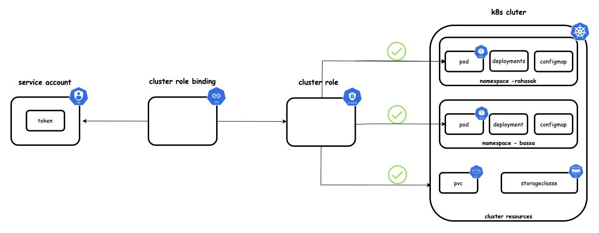
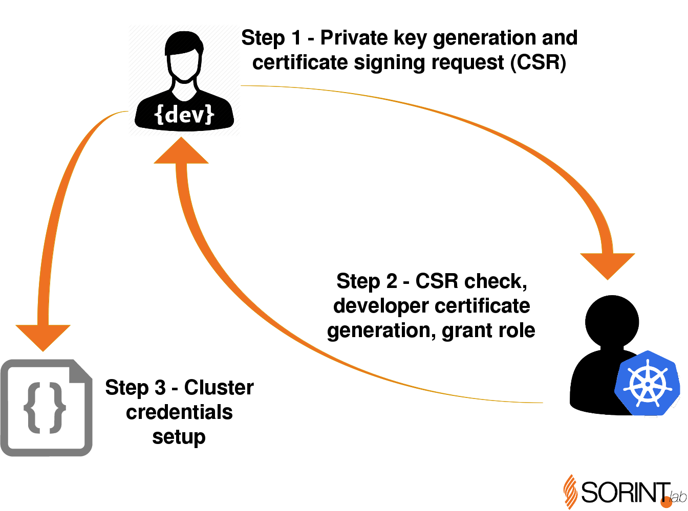

# RBAC






## Service Account

```bash
kubectl get serviceaccount

```

```yaml

apiVersion: v1
kind: ServiceAccount
metadata:
  name: pod-lister-sa
  namespace: your-namespace
```

```yaml

apiVersion: rbac.authorization.k8s.io/v1
kind: Role
metadata:
  name: pod-lister-role
  namespace: your-namespace
rules:
- apiGroups: [""]
  resources: ["pods"]
  verbs: ["list"]

```

```yaml
apiVersion: rbac.authorization.k8s.io/v1
kind: RoleBinding
metadata:
  name: pod-lister-rolebinding
  namespace: your-namespace
subjects:
- kind: ServiceAccount
  name: pod-lister-sa
  namespace: your-namespace
roleRef:
  kind: Role
  name: pod-lister-role
  apiGroup: rbac.authorization.k8s.io

```

```bash

kubectl apply -f serviceaccount.yaml
kubectl apply -f role.yaml
kubectl apply -f rolebinding.yaml


# test edebiliriz.

--as=system:serviceaccount:<ns>:<user>

k auth can-i get pods -n=default --as=system:serviceaccount:default:pod-lister-sa
no
k auth can-i list pods -n=default --as=system:serviceaccount:default:pod-lister-sa
yes
k auth can-i create pods -n=default --as=system:serviceaccount:default:pod-lister-sa
no
```


## Security Tricks

```yaml

apiVersion: apps/v1
kind: Deployment
metadata:
  name: my-deployment
  labels:
    app: my-app
spec:
  replicas: 3
  selector:
    matchLabels:
      app: my-app
  template:
    metadata:
      labels:
        app: my-app
    spec:
      // automountServiceAccountToken: false
      containers:
      - name: my-container
        image: nginx:latest
        

```

### default sa role

* default rolün bir rolebinding durumu var mı? 
```bash

kubectl get rolebindings -n <NAMESPACE> --selector=roleRef.name=default

kubectl get clusterrolebindings --selector=roleRef.name=default


```


### kubernetes user




```bash

openssl genrsa -out user.key 2048

# openssl req -new -key jane.key -out jane.csr # only set Common Name = jane

openssl req -new -key user.key -out user.csr -subj "/CN=my-service.my-namespace.svc.cluster.local"

# create CertificateSigningRequest with base64 jane.csr

cat user.csr | base64 -w 0

```

```yaml
apiVersion: certificates.k8s.io/v1
kind: CertificateSigningRequest
metadata:
  name: my-csr
spec:
  groups:
  - system:authenticated
  request: <base64 key>
  signerName: kubernetes.io/kube-apiserver-client
  usages:
  - client auth

```


```bash 
kubectl apply -f csr.yaml


kubectl certificate approve my-csr


kubectl get csr my-csr -o jsonpath='{.status.certificate}' | base64 --decode > jane.crt

```

## roller oluşturuyoruz

```yaml

apiVersion: rbac.authorization.k8s.io/v1
kind: Role
metadata:
  namespace: default
  name: pod-listing-role
rules:
- apiGroups: [""]
  resources: ["pods"]
  verbs: ["get","list", "watch"]

---

apiVersion: rbac.authorization.k8s.io/v1
kind: RoleBinding
metadata:
  name: jane-pod-listing-rolebinding
  namespace: default
subjects:
- kind: User
  name: "Jane"
  apiGroup: rbac.authorization.k8s.io
roleRef:
  kind: Role
  name: pod-listing-role
  apiGroup: rbac.authorization.k8s.io                                       

```


```bash
##  add new KUBECONFIG

kubectl config get-contexts

k config set-credentials jane --client-key=jane.key --client-certificate=jane.crt
k config set-context jane --cluster=minikube --user=jane --namespace default
k config view
k config get-contexts
k config use-context jane

kgp

```

```yaml
apiVersion: rbac.authorization.k8s.io/v1
kind: ClusterRoleBinding
metadata:
  name: jane-cluster-admin-binding
roleRef:
  apiGroup: rbac.authorization.k8s.io
  kind: ClusterRole
  name: cluster-admin
subjects:
- kind: User
  name: "Jane"
  apiGroup: rbac.authorization.k8s.io

```


```bash
k auth can-i -h

kubectl auth can-i create pods --all-namespaces

```


örnek-1 (bir ns te herşeye yetkisi var)

```yaml

kind: Role
apiVersion: rbac.authorization.k8s.io/v1
metadata:
  namespace: test
  name: testadmin
rules:
- apiGroups: ["*"]
  resources: ["*"]
  verbs: ["*"]


```


#### Kaynaklar
https://kubernetes.io/docs/reference/access-authn-authz/certificate-signing-requests
https://medium.com/rahasak/kubernetes-role-base-access-control-with-service-account-e4c65e3f25cc