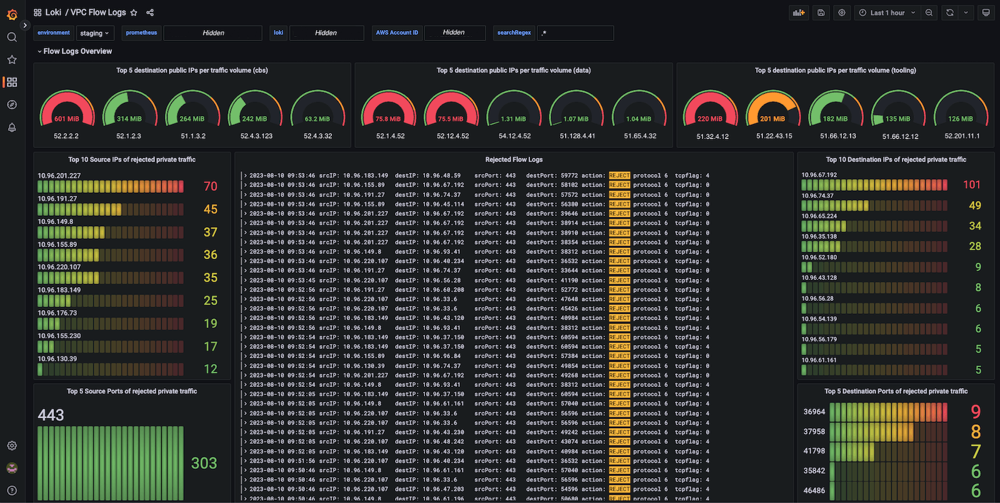

## auditing

https://kubernetes.io/docs/tasks/debug/debug-cluster/audit/
https://github.com/killer-sh/cks-course-environment/blob/master/course-content/runtime-security/auditing/kube-apiserver_enable_auditing.yaml
https://www.youtube.com/watch?v=HXtLTxo30SY


## apparmor

AppArmor (Application Armor) bir Linux güvenlik modülüdür. İşte AppArmor hakkında liste şeklinde temel bilgiler:

### 1. **Nedir?**
   - Linux sistemlerinde uygulamaları güvence altına almak için kullanılır.
   - Uygulamaların erişim ve yeteneklerini sınırlamak için güvenlik politikaları uygular.
   
   - Uygulamalara atanmış profillerle çalışır.
   - Her profil, belirli bir uygulamanın veya işlemin ne tür işlemler gerçekleştirebileceğini belirler.
   - Çekirdek düzeyinde çalışır ve gerçek zamanlı güvenlik sağlar.

### 3. **Profiller:**
   - **Zorlayıcı (Enforcing) Mod:** Profilde belirtilen politikalara uygulamaların uymasını zorlar.
   - **Öğrenme (Complain) Mod:** Uygulama eylemlerini günlüğe kaydeder ama engellemez. Profil oluşturma sürecinde kullanılır.
   - **Kapatma (Disabled) Mod:** Profil devre dışı bırakılır.

   - Uygulamaların çalışma zamanı davranışlarına göre profiller oluşturabilir ve güncelleyebilirsiniz.
   - Uygulamaları daha güvenli hale getirmek için sistem genelinde veya konteyner ortamlarında kullanılır.
   - Kubernetes ve Docker gibi teknolojilerle entegrasyonu vardır.
   - Güçlü güvenlik politikaları sağlar.
   - Esnek ve özelleştirilebilir profiller.
   - Performans üzerinde düşük etkisi vardır.
   - Web sunucuları, veritabanları ve diğer uygulamaların güvenliğini artırmak için kullanılır.
   - Dikkatlice oluşturulan profiller uygulama işlevselliğini etkilemezken güvenliği artırabilir.


* filesystem
* other processess
* networks


```c

#include <tunables/global>

profile java-spring-app /usr/bin/java flags=(attach_disconnected,mediate_deleted) {
  #include <abstractions/base>
  #include <abstractions/nameservice>
  #include <abstractions/user-tmp>
  #include <abstractions/java>

  # Allow read access to Java libraries and necessary resources
  /path/to/your/java/libraries/** r,
  
  # Allow read and execute access to your application JAR or class files
  /path/to/your/application/** rix,

  # Write access to application logs
  /path/to/your/application/logs/** rw,
}

```

```bash

sudo apparmor_parser -r -W /path/to/springboot-app

```
## deployment


```yaml
metadata:
  annotations:
    container.apparmor.security.beta.kubernetes.io/container-name: localhost/springboot-app
```

# removing shell usage
```c
#include <tunables/global>

profile no-shells flags=(attach_disconnected,mediate_deleted) {
  #include <abstractions/base>

  # Deny execution of Bash, SH, and Ash shells
  deny /bin/bash ix,
  deny /bin/sh ix,
  deny /bin/ash ix,
  deny /bin/dash ix,

  # Allow the application to read, write, and execute within its directory
  /path/to/your/application/** rix,

  # Other necessary permissions based on your application's requirement
  # ...

  # Network permissions if necessary
  # network inet,
  # network inet6,
}


```

## another method

```Dockerfile

FROM your-base-image

# Remove shell binaries
RUN rm -rf /bin/sh /bin/bash /bin/ash /bin/dash

RUN usermod -s /usr/sbin/nologin your-user
# Other Dockerfile instructions
# ...


```
## seccomp

https://www.geeksforgeeks.org/linux-system-call-in-detail/
- Linux kernel'inde sistem çağrılarını (system calls) filtrelemek için kullanılır. `seccomp` ve `AppArmor` arasında birkaç fark vardır, ve her biri farklı güvenlik gereksinimlerine hizmet eder.
`seccomp` bir Linux kernel özelliğidir.
- Uygulamaların yapabileceği sistem çağrılarını sınırlar ve böylece güvenliği artırır.
- Uygulamaların kullanabileceği sistem çağrılarını beyaz liste veya kara liste ile sınırlar.
- JSON formatında profiller oluşturulur.
- Her profil, izin verilen veya engellenen sistem çağrılarını belirtir.

```json
  {
    "defaultAction": "SCMP_ACT_ERRNO",
    "archMap": [
      {
        "architecture": "SCMP_ARCH_X86_64",
        "subArchitectures": [
          "SCMP_ARCH_X86",
          "SCMP_ARCH_X32"
        ]
      }
    ],
    "syscalls": [
      {
        "names": [
          "execve",
          "exit",
          "exit_group",
          /* other allowed syscalls */
        ],
        "action": "SCMP_ACT_ALLOW"
      }
    ]
  }

```
Dosyayı tüm Kubernetes düğümlerinde uygun bir yere kopyalayın, örneğin /var/lib/kubelet/seccomp/my-seccomp-profile.json.

```yaml
## pod için
apiVersion: v1
kind: Pod
metadata:
  name: mypod
  annotations:
    seccomp.security.alpha.kubernetes.io/pod: 'localhost/var/lib/kubelet/seccomp/my-seccomp-profile.json'
spec:
  containers:
  - name: mycontainer
    image: myimage

```

```yaml
# container için
apiVersion: v1
kind: Pod
metadata:
  name: mypod
spec:
  containers:
  - name: mycontainer
    image: myimage
    securityContext:
      seccompProfile:
        type: Localhost
        localhostProfile: my-profiles/my-seccomp-profile.json

```

https://kubernetes.io/docs/tasks/configure-pod-container/security-context/ 
https://kubernetes.io/docs/tutorials/security/seccomp/


  - `seccomp` daha çok sistem çağrılarını sınırlamak üzerine odaklanır.
  - `AppArmor` ise dosya erişimi, kapasiteler ve diğer kaynaklara erişimi kontrol eder.
  - `seccomp` daha ince taneli kontrol sağlar, ancak kullanımı daha karmaşık olabilir.
  - `AppArmor` genellikle daha kullanıcı dostudur ve hızlı profil oluşturma imkanı sunar.
  - İki teknoloji birlikte kullanılabilir; her biri farklı güvenlik katmanları sağlar.


## kubespray hardening
* https://github.com/kubernetes-sigs/kubespray/blob/master/docs/hardening.md

# diğerleri (atak yüzeyini azaltma)

* işe yaramayan servisleri kaldırma. örn. snapd
* ss -tlpn
* sistem userları ve yetkileri


# taint 

```bash

kubectl taint nodes <control-plane-node-name> key1=value1:NoSchedule


```

```yaml

apiVersion: apps/v1
kind: Deployment
metadata:
  name: my-deployment
spec:
  replicas: 3
  selector:
    matchLabels:
      app: my-app
  template:
    metadata:
      labels:
        app: my-app
    spec:
      tolerations:
      - key: "key1"
        operator: "Equal"
        value: "value1"
        effect: "NoSchedule"
      containers:
      - name: my-container
        image: my-image


```


## log 2 remote 

* filebeat 

```yaml

filebeat.inputs:
- type: log
  enabled: true
  paths:
    - /var/log/kube-apiserver.log
    - /var/log/kube-scheduler.log
    - /var/log/kube-controller-manager.log
    # Add other control plane log paths as needed

output.elasticsearch:
  hosts: ["<your-elasticsearch-host>:<your-elasticsearch-port>"]


```

```yaml

apiVersion: apps/v1
kind: DaemonSet
metadata:
  name: filebeat
  namespace: kube-system
spec:
  selector:
    matchLabels:
      k8s-app: filebeat
  template:
    metadata:
      labels:
        k8s-app: filebeat
    spec:
      containers:
      - name: filebeat
        image: docker.elastic.co/beats/filebeat:<version>
        args: [
          "-c", "/etc/filebeat/filebeat.yml",
          "-e",
        ]
        volumeMounts:
        - name: config
          mountPath: /etc/filebeat
          readOnly: true
        - name: logs
          mountPath: /var/log
          readOnly: true
      volumes:
      - name: config
        configMap:
          defaultMode: 0600
          name: filebeat-config
      - name: logs
        hostPath:
          path: /var/log


```


* https://grafana.com/oss/loki/

